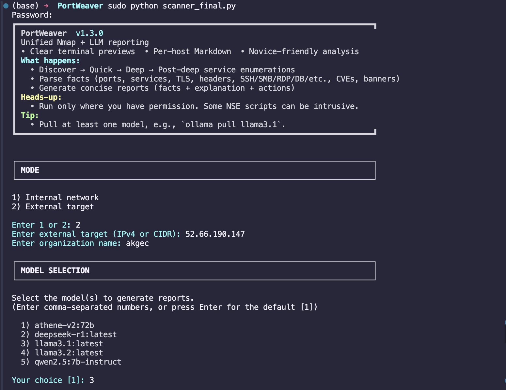
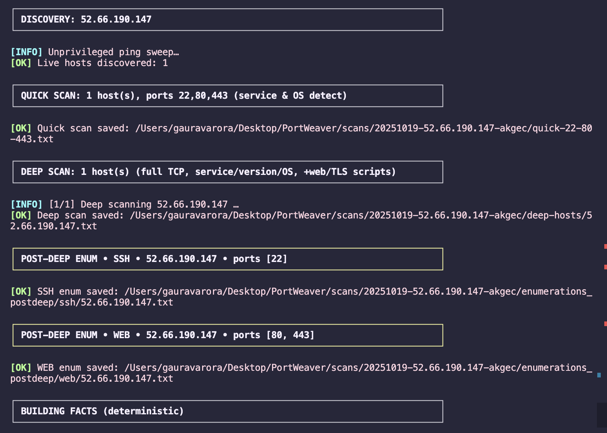
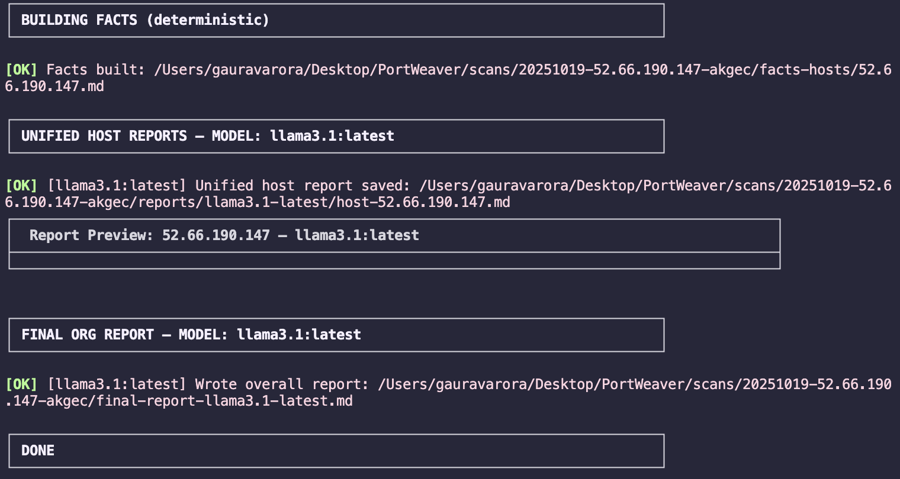

# PortWeaver

**PortWeaver** is a pipeline **Nmap + local LLM (Ollama)** scanner that turns raw scans into **clean, novice-friendly security reports**—without losing technical detail.

<p align="center">
  
</p>

<p align="center">
  
</p>

<p align="center">
  
</p>

* ✅ Fully chained pipeline: **Discovery → Quick → Deep → Broad Enumerations → Facts → Per-Host LLM → Final Report**
* ✅ **Per-host Markdown reports** include **verbatim facts** (ports/services/TLS/headers/SSH/CVEs/banners) **+** plain-English risk & actions
* ✅ **Final report** (per model) with exec summary **and** a complete per-host appendix (Facts, Model Report, Enum Highlights)
* ✅ Clean, colorized **terminal preview** (no raw Nmap dumps)
* ✅ **Interactive model picker** (shows only locally available Ollama models) *or* pass `--models` for A/B testing

> ⚠️ **Only scan assets you own or have explicit written permission to test.** Some NSE scripts are intrusive.


## Features

* **Accurate facts extraction** (verbatim from Nmap/NSE):
  Ports, services, versions, OS/CPE hints, TLS/cert, HTTP headers/title/robots/vhosts, SSH algos/keys, banners, explicit CVE IDs
* **Novice-friendly LLM summaries**: simple language, crisp risk bullets, prioritized actions
* **Enumerations *after* deep scan**: broad service profiles (web, ssh, smb, rdp, ftp, smtp, dns, dbs, redis, mongo, memcached, vnc, winrm, docker, kubelet, elastic, jenkins, …)
* **Final report won’t miss info**: LLM org-summary + deterministic appendices that include **all** facts & enum highlights

---

## Requirements

* **OS:** macOS or Linux
* **Python:** 3.9+
* **Nmap:** 7.93+
* **Ollama:** latest (for local LLMs)
* **Python packages:** see `requirements.txt`

### Install Nmap & Ollama

**macOS (Homebrew):**

```bash
brew install nmap ollama
```

**Ubuntu/Debian:**

```bash
sudo apt update
sudo apt install -y nmap curl
curl -fsSL https://ollama.com/install.sh | sh
```

Verify:

```bash
nmap --version
ollama list
```

### Pull at least one model

```bash
# Recommended baseline
ollama pull llama3.1

# Optional for comparison (A/B testing)
ollama pull qwen2.5:7b-instruct
```

---

## Install

```bash
git clone https://github.com/<your-username>/PortWeaver.git
cd PortWeaver

# Optional but recommended
python3 -m venv .venv
source .venv/bin/activate  # Windows: .venv\Scripts\activate

pip install -r requirements.txt
```

`requirements.txt`

```txt
ollama>=0.3.0
```

> Nmap is **not** a Python package—install via your OS package manager (see above).

---

## Quick Start

> Many scans use SYN and need raw sockets—**run with `sudo`**.

**Internal network** (auto-detects a /24 on macOS; or pass `--cidr`)

```bash
sudo python portweaver.py --mode internal --org "HomeLab"
```

**External target** (IP or CIDR)

```bash
sudo python portweaver.py --mode external --target 203.0.113.0/24 --org "Acme"
```

If you **don’t** pass `--models`, PortWeaver shows a **numbered list** of **locally available** models from `ollama list`.

---

## Usage Examples

**Pick models interactively (installed ones):**

```bash
sudo python portweaver.py --mode external --target 203.0.113.0/24 --org "Acme"
```

**Preselect models (skip menu):**

```bash
sudo python portweaver.py --mode external --target 203.0.113.0/24 --org "Acme" \
  --models llama3.1,qwen2.5:7b-instruct
```

**Include vulnerability scripts** (slower / potentially intrusive):

```bash
sudo python portweaver.py --mode external --target 203.0.113.0/24 --org "CustomerX" --with-vuln
```

**Faster timing** (noisier):

```bash
sudo python portweaver.py --mode internal --org "Lab" --aggressive
```

**Custom output path:**

```bash
sudo python portweaver.py --mode external --target 198.51.100.0/24 --org "BlueTeam" --outdir /tmp/portweaver-run
```

---

## CLI Options

| Option                       | Description                                                              |
| ---------------------------- | ------------------------------------------------------------------------ |
| `--mode {internal,external}` | Scan local network or an external target                                 |
| `--target <IP/CIDR>`         | Required for `external` mode                                             |
| `--cidr <CIDR>`              | Override auto-detect in `internal` mode (e.g., `192.168.1.0/24`)         |
| `--org "<Name>"`             | Organization/run label in output path                                    |
| `--models <m1,m2,...>`       | Use specific Ollama models (else interactive picker of installed models) |
| `--with-vuln`                | Include NSE `vuln` scripts (slower; potentially intrusive)               |
| `--aggressive`               | Use `-T5` timing (faster, noisier)                                       |
| `--outdir <path>`            | Custom output directory                                                  |

---

## How It Works

1. **Discovery** → ping sweep (unprivileged → privileged fallback) → `live.txt`
2. **Quick** → `-Pn -n -p22,80,443 -sV -O` → quick triage
3. **Deep per host** → full TCP `-p- -sS -sV --version-all -O -A` + web/TLS NSE
4. **Post-deep enumerations** → service-specific NSE profiles (web, ssh, smb, rdp, dbs, etc.)
5. **Facts extraction** → deterministic verbatim facts per host (no AI)
6. **Per-host LLM report** → concise explanation + actions, **embedding the Facts**
7. **Final report (per model)** → LLM org-summary **with full context** + per-host appendix (Facts, Model Report, Enum Highlights)

---

## Output Structure

<details>
<summary><strong>Click to expand</strong></summary>

```
scans/2025MMDD-203.0.113.0_24-Acme/
├── live.txt
├── quick-22-80-443.txt
├── deep-hosts/
│   ├── 203.0.113.10.txt
│   └── 203.0.113.32.txt
├── enumerations_postdeep/
│   ├── web/203.0.113.10.txt
│   ├── ssh/203.0.113.10.txt
│   ├── smb/203.0.113.32.txt
│   └── ... (profiles per service)
├── facts-hosts/
│   ├── 203.0.113.10.md          # VERBATIM facts per host (authoritative)
│   └── 203.0.113.32.md
├── reports/
│   └── llama3.1/
│       ├── host-203.0.113.10.md  # unified per-host (facts + analysis + actions)
│       └── host-203.0.113.32.md
└── final-report-llama3.1.md      # LLM org summary + complete per-host appendix
```

</details>

**Terminal preview** is clean and colorized; raw Nmap output is saved to files but **not** dumped on screen.

---

## Model Tips

* **Baseline:** `llama3.1` is a great default and fairly light.
* **Compare:** Add `qwen2.5:7b-instruct` to see stylistic/coverage differences.
* If a **large** model crashes (`signal: killed`), try a smaller model or close memory-heavy apps.
* Keep Ollama updated (`ollama update`) and check your local models (`ollama list`).

---

## Troubleshooting

**`llama runner process ... killed (500)`**
Likely OOM. Try a smaller model (e.g., `llama3.1`), close heavy apps, or reduce context (PortWeaver falls back for some cases).

**“No live hosts found”**
PortWeaver will still attempt `-Pn` scans for CIDR targets. Consider firewalls, scope, or connectivity.

**Nmap/Ollama not found**
Install via your OS package manager and verify:

```bash
nmap --version
ollama list
```

---

## Security & Legal

* Obtain **written authorization** before scanning any non-owned assets.
* Some NSE scripts (especially with `--with-vuln`) can be **intrusive**.
* The authors are **not responsible** for misuse.

---

## Roadmap

* Optional UDP scan stage
* HTML/PDF export
* JSON machine-readable artifacts
* Service-family filters

---

## Credits

Built on **Nmap** and **Ollama**. PortWeaver orchestrates scans, enumerations, and LLM reporting to produce a single, clean deliverable for engineers and non-engineers alike.

